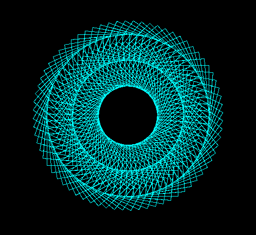
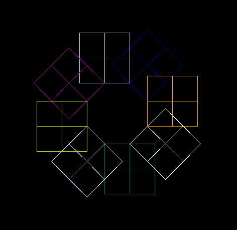
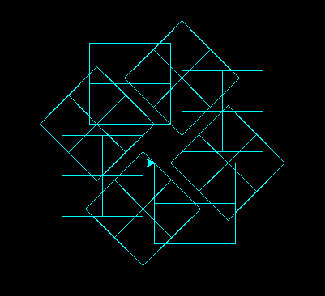
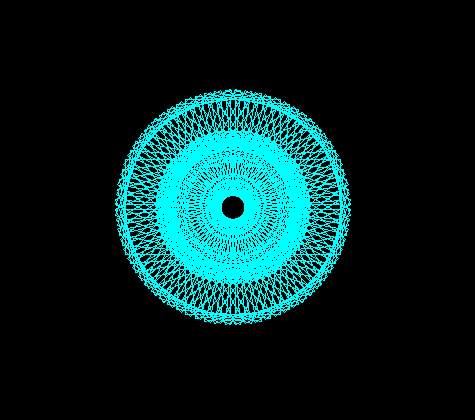
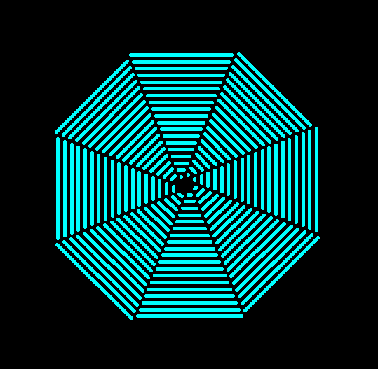
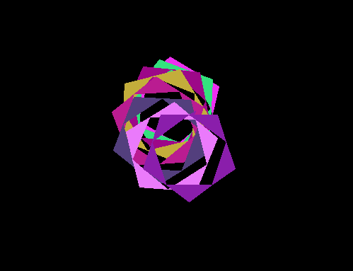
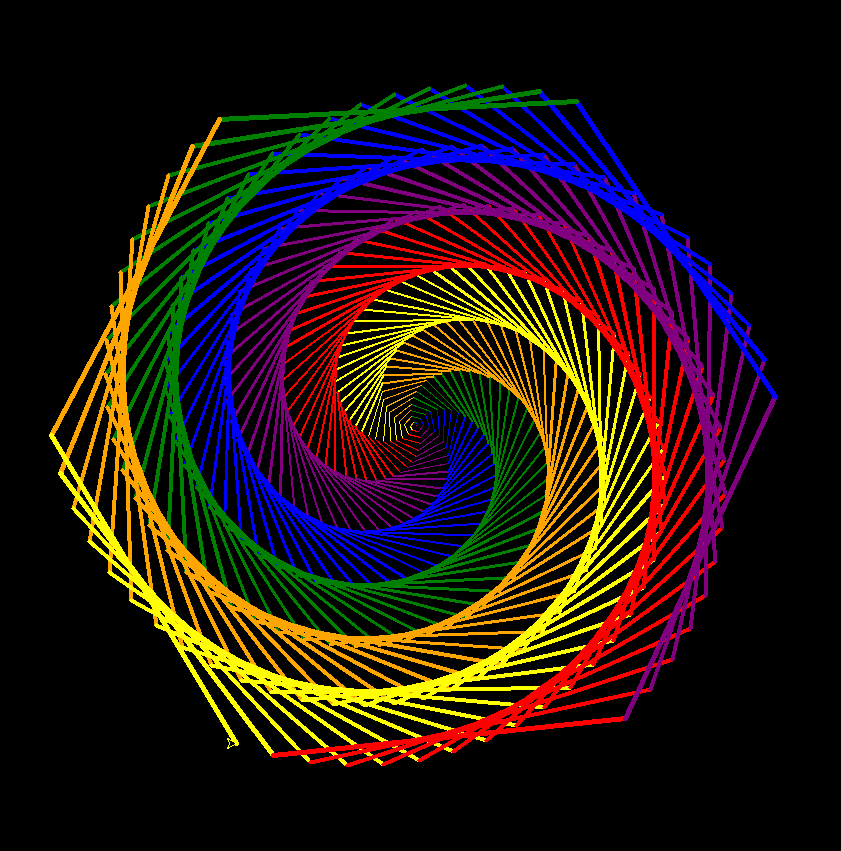
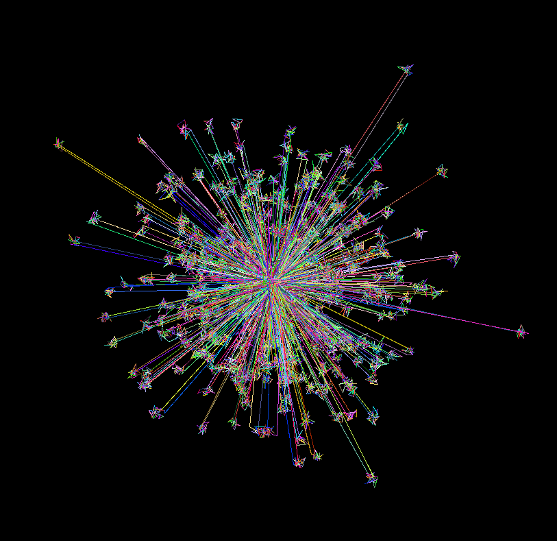
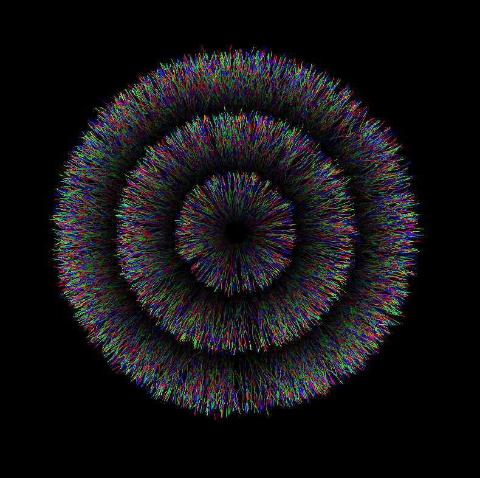
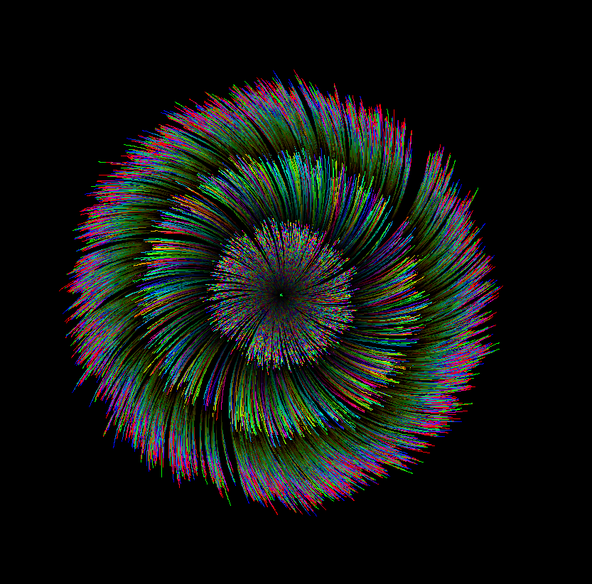

# figures

##### example01

##### example02

##### example03

##### example04

##### example05

##### example06

##### example07

##### example08

##### example09

##### example10

##### example11

##### example12

